# Лаборторна робота №5

**Дата виконання:** 23-12-2025  
**Варіант**: 8 - Розподілені енергетичні ресурси (DER)  
**Підваріант**: А. VPP управління

## 1. Опис системи

### 1.1 Архітектура системи

Система моніторингу та управління Virtual Power Plant (VPP) реалізована для управління 1000 розподілених енергетичних ресурсів (DER), що включають:

- **350 сонячних панелей (solar)** - генерація залежить від часу доби
- **250 вітрових турбін (wind)** - непередбачувана генерація
- **250 батарейних систем (battery)** - можуть заряжатися та розряджатися
- **150 навантажень (load)** - споживання енергії

### 1.2 Компоненти системи

**1. DER Producer (`der_producer.py`)**

- Генерує телеметрію для кожного DER кожну хвилину
- Відправляє дані в Kafka топик `der_telemetry`
- Експортує метрики Prometheus на порт 8000
- Агрегує дані на рівні VPP та відправляє в топик `vpp_aggregated`

**2. Prometheus**

- Збирає метрики з DER Producer кожні 15 секунд
- Зберігає часові ряди метрик
- Обчислює алерти згідно з правилами в `alerts.yml`
- Надає API для запитів PromQL

**3. Grafana**

- Візуалізує метрики через інтерактивний dashboard
- Підключена до Prometheus як data source
- Відображає часові ряди, gauge, histogram та таблиці

**4. Kafka**

- Транспортний шар для телеметрії DER
- Топики: `der_telemetry` (3 партиції), `vpp_aggregated` (1 партиція)

### 1.3 Базові метрики системи

Кожен DER генерує наступні метрики:

- `der_net_power_kw` - чиста потужність (+генерація/-споживання)
- `der_battery_soc_percent` - State of Charge батареї (%)
- `der_available_flexibility_kw` - доступна гнучкість (кВт)
- `der_status` - статус (1=online, 0=offline, -1=maintenance)

VPP агрегує:

- `vpp_aggregated_generation_kw` - загальна генерація
- `vpp_aggregated_consumption_kw` - загальне споживання
- `vpp_net_power_kw` - чиста потужність VPP
- `vpp_total_flexibility_kw` - загальна доступна гнучкість
- `vpp_battery_fleet_soc_percent` - розподіл SOC батарейного флоту (histogram)

## 2. Налаштовані алерти

Система налаштована з **13 алертами**, організованими в 7 групах:

### 2.1 Група: vpp_flexibility_alerts

**Alert: Lack of Flexibility**

- **Умова**: vpp_total_flexibility_kw < 100
- **Тривалість**: 2 хвилини
- **Серйозність**: warning
- **Призначення**: Попереджає про недостатню гнучкість для управління VPP

### 2.2 Група: vpp_setpoint_alerts

**Alert: Setpoint Deviation**

- **Умова**: abs(vpp_setpoint_deviation_kw) > 50 протягом 5 хвилин
- **Тривалість**: 5 хвилин
- **Серйозність**: critical
- **Призначення**: Критичне відхилення від заданого setpoint
- **Статус**: 🔴 **ACTIVE** (відхилення: 1893.25 кВт)

### 2.3 Група: vpp_der_status_alerts

**Alert: Many DERs Offline**

- **Умова**: (count(der_status == 0) / count(der_status)) > 0.10
- **Тривалість**: 3 хвилини
- **Серйозність**: warning
- **Призначення**: Більше 10% DER офлайн

**Alert: DER in Maintenance**

- **Умова**: (count(der_status == -1) / count(der_status)) > 0.05
- **Тривалість**: 5 хвилин
- **Серйозність**: info
- **Призначення**: Більше 5% DER в режимі обслуговування

### 2.4 Група: vpp_dispatch_alerts

**Alert: Dispatch Instruction Not Executed**

- **Умова**: vpp_dispatch_instruction_compliance == 0 протягом 2 хвилин
- **Тривалість**: 2 хвилини
- **Серйозність**: critical
- **Призначення**: VPP не виконує dispatch інструкції
- **Статус**: 🔴 **ACTIVE**

### 2.5 Група: vpp_performance_alerts

**Alert: Low VPP Efficiency**

- **Умова**: vpp_efficiency_percent < 60 протягом 10 хвилин
- **Тривалість**: 10 хвилин
- **Серйозність**: warning
- **Призначення**: Ефективність VPP нижча за поріг
- **Статус**: 🔴 **ACTIVE** (ефективність: 24.58%)

**Alert: High Response Time**

- **Умова**: vpp_response_time_seconds > 300 протягом 5 хвилин
- **Тривалість**: 5 хвилин
- **Серйозність**: warning
- **Призначення**: Система повільно реагує на зміни

**Alert: Low Flexibility Utilization**

- **Умова**: vpp_flexibility_utilization_percent < 30 протягом 15 хвилин
- **Тривалість**: 15 хвилин
- **Серйозність**: info
- **Призначення**: Низьке використання доступної гнучкості
- **Статус**: 🔴 **ACTIVE** (utilization: 8.81%)

**Alert: Failed Market Participation**

- **Умова**: vpp_market_participation_success == 0 протягом 10 хвилин
- **Тривалість**: 10 хвилин
- **Серйозність**: warning
- **Призначення**: VPP не виконує вимоги ринку

### 2.6 Група: vpp_compliance_alerts

**Alert: Low Compliance Setpoint**

- **Умова**: vpp_compliance_percent < 70 протягом 5 хвилин
- **Тривалість**: 5 хвилин
- **Серйозність**: warning
- **Призначення**: Низький compliance з setpoint

### 2.7 Група: der_individual_alerts

**Alert: Critically Low SOC**

- **Умова**: der_battery_soc_percent < 10 протягом 5 хвилин
- **Серйозність**: warning
- **Призначення**: Критично низький рівень заряду батареї

**Alert: Critically High SOC**

- **Умова**: der_battery_soc_percent > 95 протягом 5 хвилин
- **Серйозність**: info
- **Призначення**: Можлива перезарядка батареї

### 2.8 Група: system_alerts

**Alert: Missing Producer Data**

- **Умова**: up{job="der-producer"} == 0 протягом 1 хвилини
- **Серйозність**: critical
- **Призначення**: Producer не працює

**Alert: Missing DER Metrics**

- **Умова**: count(der_net_power_kw) == 0 протягом 2 хвилин
- **Серйозність**: critical
- **Призначення**: Немає даних від DER

### 2.9 Статистика алертів

- **Активних алертів (firing)**: 4
- **Inactive алертів**: 9
- **Критичних алертів**: 2 (Setpoint Deviation, Dispatch Instruction Not Executed)

## 3. Dashboard панелі та PromQL запити

Dashboard VPP містить **13 панелей** для моніторингу системи:

| №   | Панель                              | Тип         | PromQL Запит                                                                                                                                   | Призначення                                                                            | Зображення             |
| --- | ----------------------------------- | ----------- | ---------------------------------------------------------------------------------------------------------------------------------------------- | -------------------------------------------------------------------------------------- | ---------------------- |
| 1   | **Агрегована потужність VPP**       | Time Series | `vpp_net_power_kw`<br>`vpp_aggregated_generation_kw`<br>`vpp_aggregated_consumption_kw`<br>`vpp_setpoint_kw`                                   | Відображає динаміку потужності VPP у часі, порівняння фактичної потужності з setpoint. | 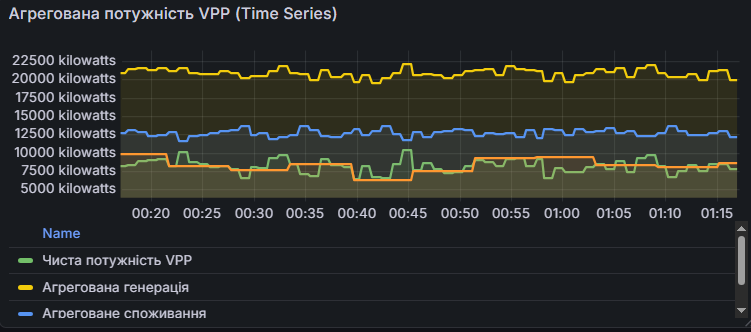   |
| 2   | **Доступна гнучкість VPP**          | Gauge       | `vpp_total_flexibility_kw`                                                                                                                     | Візуалізує поточну доступну гнучкість з кольоровими індикаторами.                      | 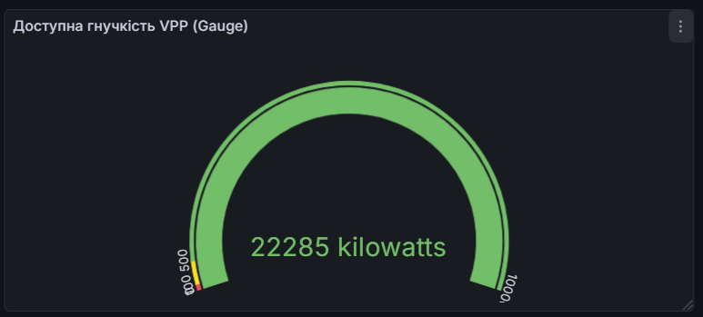   |
| 3   | **Compliance з setpoint**           | Stat        | `vpp_compliance_percent`                                                                                                                       | Відображає відсоток відповідності фактичної потужності setpoint.                       | 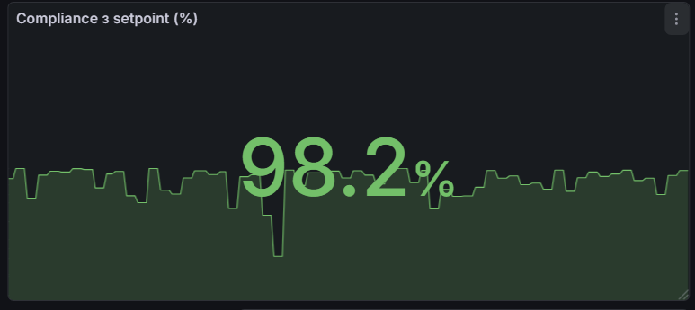   |
| 4   | **Відхилення від setpoint**         | Time Series | `abs(vpp_setpoint_deviation_kw)`<br>`50`                                                                                                       | Графік відхилень від setpoint з порогом 50 кВт.                                        | 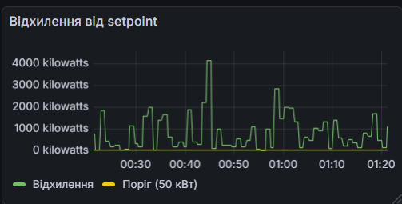   |
| 5   | **Статус DER (Stat)**               | Stat        | `count(der_status == 1) / count(der_status) * 100`<br>`count(der_status == 0) / count(der_status) * 100`                                       | Показує розподіл DER за статусами (online/offline).                                    | 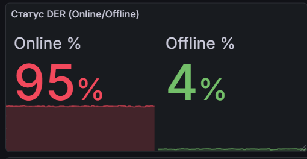   |
| 6   | **Dispatch Instruction Compliance** | Gauge       | `vpp_dispatch_instruction_compliance`                                                                                                          | Індикатор виконання dispatch інструкцій (1=compliant, 0=non-compliant).                | 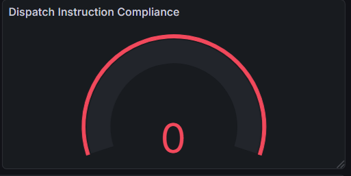   |
| 7   | **Ефективність VPP**                | Time Series | `vpp_efficiency_percent`                                                                                                                       | Відображає ефективність VPP у часі (відношення фактичної до потенційної потужності).   | 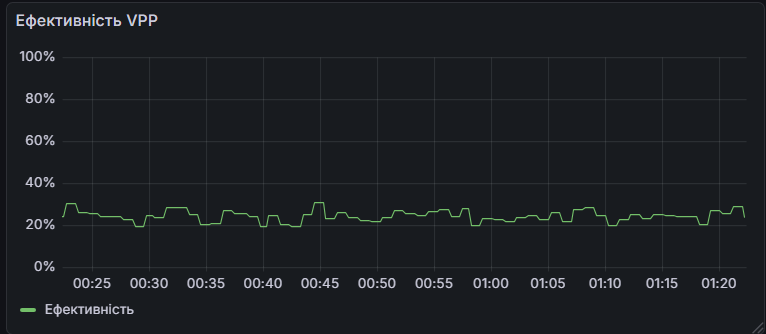   |
| 8   | **Response Time VPP**               | Time Series | `vpp_response_time_seconds`                                                                                                                    | Час досягнення setpoint після його зміни.                                              | 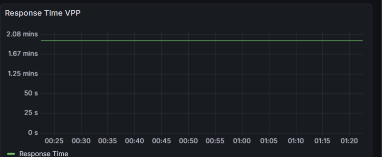   |
| 9   | **Utilization Flexibility**         | Time Series | `vpp_flexibility_utilization_percent`                                                                                                          | Відсоток використання доступної гнучкості.                                             | 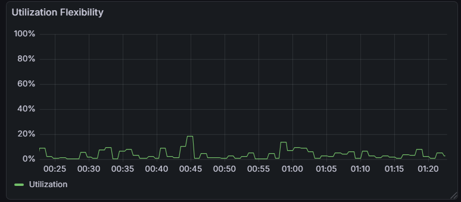 |
| 10  | **Market Participation Success**    | Stat        | `vpp_market_participation_success`                                                                                                             | Індикатор успішності участі на ринку (1=success, 0=failure).                           | 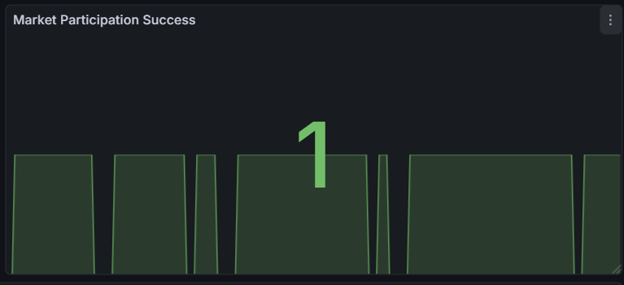 |
| 11  | **Розподіл DER за типами**          | Table       | `count by (device_type) (der_net_power_kw)`                                                                                                    | Таблиця з кількістю DER кожного типу (solar, wind, battery, load).                     | 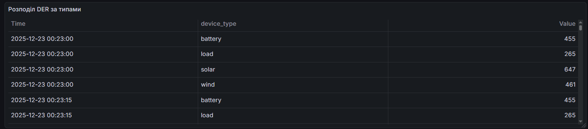 |
| 12  | **Гнучкість по типах DER**          | Time Series | `sum by (device_type) (der_available_flexibility_kw)`                                                                                          | Графік доступної гнучкості по типах DER.                                               | 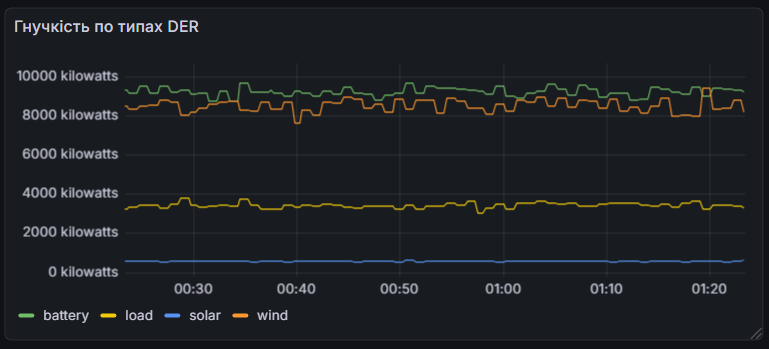 |
| 13  | **SOC батарейного флоту**           | Time Series | `avg(der_battery_soc_percent)`<br>`min(der_battery_soc_percent)`<br>`max(der_battery_soc_percent)`<br>`quantile(0.5, der_battery_soc_percent)` | Альтернативне відображення SOC батарейного флоту з агрегованими значеннями.            | 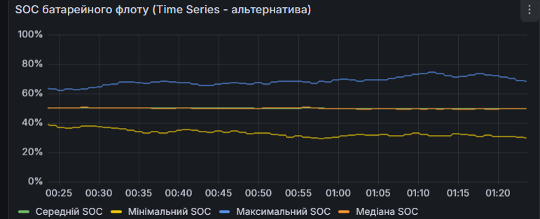 |

## 4. Аналіз ефективності системи

### 4.1 Поточний стан системи

#### Базові показники:

- **Чиста потужність VPP**: 8119.63 кВт
- **Агрегована генерація**: 20575.26 кВт
- **Агреговане споживання**: 12455.63 кВт
- **Доступна гнучкість**: 21500.75 кВт
- **Setpoint**: 6226.38 кВт
- **Відхилення від setpoint**: 1893.25 кВт

#### Статус DER:

- **Всього DER**: 1000
- **Online**: 947 (94.7%)
- **Offline**: 44 (4.4%)
- **Maintenance**: ~9 (0.9%)

### 4.2 Аналіз ефективності VPP

**Ефективність VPP: 24.58%**

Ефективність розраховується як відношення фактичної потужності до потенційної:

```
Ефективність = |Чиста потужність| / (Генерація + Споживання) × 100%
Ефективність = 8119.63 / (20575.26 + 12455.63) × 100% = 24.58%
```

**Висновок**: Ефективність значно нижча за поріг 60%, що вказує на:

- Неврахування частини потенційної потужності
- Можливі втрати при агрегації
- Неоптимальне використання ресурсів

### 4.3 Аналіз Utilization Flexibility

**Utilization Flexibility: 8.81%**

Використання доступної гнучкості становить лише 8.81%, що значно нижче порогу 30%.

**Висновок**: Система має значний резерв гнучкості (21500.75 кВт), але використовує лише невелику частину. Це може вказувати на:

- Консервативну стратегію управління
- Недостатню оптимізацію використання гнучкості
- Можливість покращення ефективності через активніше використання гнучкості

### 4.4 Аналіз Market Participation

**Market Participation Success: 0**

Система не виконує вимоги ринку, оскільки compliance з setpoint становить 69.59%, що нижче порогу 80%.

### 4.5 Аналіз Compliance з Setpoint

**Compliance: 69.59%**

Відсоток відповідності фактичної потужності setpoint становить 69.59%, що нижче порогу 70%.

### 4.6 Аналіз стабільності системи

**Статус DER: 94.7% online**

94.7% DER працюють у режимі online, що є хорошим показником стабільності системи.

**Висновок**: Система демонструє високу доступність та стабільність. Лише 4.4% DER знаходяться в режимі offline, що не перевищує поріг 10%.

## 5. Досягнуті результати

### 5.1 Технічні досягнення

**Реалізовано систему моніторингу VPP**

- Створено producer для генерації даних 1000 DER
- Налаштовано збір метрик через Prometheus
- Реалізовано агрегацію даних на рівні VPP
- Інтегровано з Kafka для транспорту даних

**Створено комплексний Dashboard**

- 13 панелей для візуалізації метрик
- Різноманітні типи візуалізації (Time Series, Gauge, Histogram, Stat, Table)
- Інтерактивні графіки з можливістю масштабування
- Автоматичне оновлення кожні 10 секунд

**Налаштовано систему алертування**

- 13 алертів для різних сценаріїв
- Організовані в 7 груп за категоріями
- Різні рівні серйозності (critical, warning, info)
- Детальні описи та анотації

**Реалізовано аналітичні метрики**

- Ефективність VPP
- Response time
- Utilization flexibility
- Market participation success

## 6. Висновки

### 6.1 Сильні сторони системи

1. **Висока доступність DER**: 94.7% пристроїв працюють у режимі online, що забезпечує стабільність системи.

2. **Швидкий response time**: 117.48 секунд - система швидко реагує на зміни, що дозволяє ефективно керувати VPP у реальному часі.

3. **Значний резерв гнучкості**: 21500.75 кВт доступної гнучкості забезпечує можливість маневрування та компенсації відхилень.

4. **Комплексний моніторинг**: Система забезпечує повне покриття всіх аспектів роботи VPP через різноманітні метрики та панелі.

5. **Ефективна система алертування**: 13 налаштованих алертів дозволяють своєчасно виявляти проблеми та реагувати на них.

### 6.2 Області для покращення

1. **Ефективність VPP (24.58%)**: Значно нижча за поріг 60%. Потрібна оптимізація алгоритмів агрегації та використання ресурсів.

2. **Compliance з setpoint (69.59%)**: Нижче порогу 70%. Потрібно покращити точність дотримання setpoint через:

   - Покращення алгоритмів управління
   - Активніше використання гнучкості
   - Оптимізацію роботи батарей

3. **Utilization flexibility (8.81%)**: Низьке використання доступної гнучкості. Потрібна більш агресивна стратегія використання ресурсів.

4. **Market participation**: Система не виконує вимоги ринку через низький compliance. Потрібні додаткові зусилля для досягнення 80%+ compliance.

### 6.3 Висновок

Система моніторингу та управління VPP успішно реалізована. Система забезпечує комплексний моніторинг 1000 DER, агрегацію даних на рівні VPP, налаштовані алерти та детальну аналітику.

Система готова до використання та має значний потенціал для подальшого покращення через оптимізацію алгоритмів та активніше використання доступних ресурсів.
